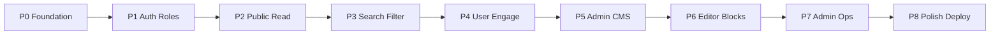

# Knowledge FStack — Phân phase & thông tin cần cung cấp

Repo hiện chỉ có [`knowledge_base.md`](knowledge_base.md) (greenfield). Stack cố định: **Next.js App Router + TypeScript + Tailwind + Supabase + Tiptap → Vercel**.

---

## Phân tích tính năng (theo nhóm)

| Nhóm | Tính năng chính | Vai trò |
|------|-----------------|--------|
| Nền tảng | Auth Google + Email/password, theme light/dark, layout responsive, SEO | Guest → User → Admin |
| Nội dung công khai | Home, category/tag, list filter/sort/pagination, search, article detail + TOC + code copy | Guest đọc full |
| Tương tác user | Rating + quick feedback, bookmark, learning progress, comment/reply 1 cấp + vote | Cần login |
| Góp ý | Feedback form (có selected text), admin xử lý trạng thái | User gửi / Admin xử lý |
| Admin CMS | Dashboard, CRUD bài (Tiptap + custom blocks), category/tag, image storage, comment moderation | `ADMIN_EMAILS` |
| Chất lượng | RLS/security, a11y, performance (RSC), tests, docs, Cursor rules/skills, seed content | DevOps/process |

**Phạm vi MVP rõ:** chỉ admin tạo bài; không user UGC publish; không NestJS/Firebase/styled-components; free tier.

---

## Audit: skill + rule đối chiếu phase ↔ PRD ↔ plan

Mục tiêu: bất kỳ lúc nào (sau mỗi phase, trước khi ship, hoặc khi hỏi “đã khớp knowledge_base chưa?”) agent chạy một quy trình cố định để so khớp **3 nguồn sự thật**:

1. [`knowledge_base.md`](knowledge_base.md) — PRD đầy đủ (mục 1–34 + acceptance).
2. [Plan phases](.cursor/plans/knowledge_fstack_phases_e0b638cd.plan.md) — phạm vi từng P0–P8.
3. **Codebase hiện tại** — file/route/schema/test thực tế đã có.

### Chọn Skill (chính) + Rule (nhắc)

| Artifact | Vai trò |
|----------|---------|
| **Skill** `.cursor/skills/audit-phases/SKILL.md` | Workflow audit đầy đủ — đọc PRD + plan + repo, xuất báo cáo gap |
| **Rule** `.cursor/rules/phase-prd-alignment.mdc` | Nhắc ngắn: trước khi đánh dấu phase done / claim “khớp PRD”, phải chạy skill `audit-phases` |

Không chỉ dùng rule: rule quá dài sẽ loãng; skill mới giữ checklist chi tiết và chỉ load khi cần.

### Skill `audit-phases` — nội dung bắt buộc

**Triggers (description):** khi user hỏi check phase / khớp knowledge_base / PRD coverage / trước khi đóng phase / trước acceptance mục 34.

**Quy trình agent phải làm:**

1. Đọc `knowledge_base.md` (hoặc mục liên quan nếu audit 1 phase).
2. Đọc plan phase hiện tại (P0–P8 + acceptance).
3. Quét repo: routes, components, migrations, tests, docs, `.cursor/rules|skills`.
4. Map từng requirement PRD → phase plan → evidence trong code.
5. Xuất báo cáo theo template:

```markdown
## Audit: Phase Px | Full MVP
- PRD sections covered: …
- Plan scope: …
- Implemented: … (file paths)
- Missing / partial: … (cite knowledge_base section)
- Out of scope / deferred: …
- Verdict: PASS | PASS_WITH_GAPS | FAIL
- Next actions: …
```

**Checklist mapping cố định trong skill** (rút từ PRD → phase):

- P0: stack, theme, env, schema skeleton, Cursor scaffolding
- P1: Auth §2, roles §1, login modal
- P2: Header §3, Home §4, list/detail §5/§7 (read path), seed §27
- P3: Search §6, filters URL §5, SEO §23
- P4: Rating §8, Bookmark §9, Progress §10, Comment §11
- P5: Dashboard §14, Article mgmt §15, Image §17
- P6: Tiptap editor §16 + custom blocks §7
- P7: Category §18, Tag §19, feedback admin §12, comment moderation §11
- P8: Theme §20, Responsive §21, A11y §22, Perf §24, Security §25, States §26, Test §28, Docs §29, Rules §30, Skills §31, README §32, Deploy §33, Acceptance §34

**Hard rules trong skill:**

- Không đánh dấu PASS nếu thiếu acceptance criteria liên quan phase.
- Không mở rộng ngoài MVP; ghi rõ “out of scope” nếu PRD nói không làm.
- Mọi gap phải cite mục trong `knowledge_base.md` (ví dụ §11 Comment).
- Sau audit, nếu đang implement: chỉ sửa trong scope phase hiện tại trừ khi user yêu cầu full MVP.

### Rule `phase-prd-alignment.mdc`

```yaml
---
description: Trước khi đóng phase hoặc claim khớp PRD, chạy skill audit-phases
alwaysApply: true
---
```

Nội dung ngắn (~15–20 dòng): nguồn sự thật là `knowledge_base.md` + plan phases; không claim hoàn thành phase khi chưa audit; khi user hỏi “khớp chưa?” → đọc và follow `.cursor/skills/audit-phases/SKILL.md`.

### Khi nào tạo trong roadmap

- **Tạo ngay đầu Phase 0** (trước hoặc cùng Cursor rules/skills skeleton) để mọi phase sau đều có công cụ đối chiếu.
- Sau mỗi phase hoàn thành: bắt buộc chạy `audit-phases` cho phase đó trước khi sang phase tiếp theo.
- Trước ship: chạy full MVP audit map với acceptance §34.

---

## Roadmap theo phase nhỏ



### Phase 0 — Foundation (1–2 ngày)
- **Trước tiên:** tạo skill `audit-phases` + rule `phase-prd-alignment` (xem section Audit ở trên).
- Scaffold Next.js (App Router, TS, Tailwind), design tokens theo [dat-profile](https://dat-profile-ga-ga.vercel.app/) (không copy code).
- Supabase project + schema tối thiểu: `profiles`, `categories`, `tags`, `articles`, junction tables.
- RLS skeleton, `.env.example`, theme provider (light default, no FOUC).
- Các Cursor rules/skills còn lại theo §30–§31 + `docs/` stubs.
- Kết thúc P0: chạy `audit-phases` cho Phase 0.

### Phase 1 — Auth & phân quyền
- Google OAuth + Email/password (register, confirm, forgot/reset).
- Profile: username unique, avatar, display name.
- Login modal (không rời trang bài); redirect về trang trước; preserve draft comment.
- Admin check server-side qua `ADMIN_EMAILS`.

### Phase 2 — Public reading experience
- Header/nav/mobile menu; Home (hero gọn + category grid + sections bài).
- Article list cards; Article detail: breadcrumb, metadata, cover, reading progress, share/copy link.
- Tiptap **renderer** (chưa editor) + code highlight + copy; TOC sticky/collapsible.
- Seed ~8 bài + categories/tags theo mục 27.

### Phase 3 — Search, filter, sort, SEO
- URL-synced filters (category, tag, level, sort, page).
- Search page + header search; ưu tiên title; hỗ trợ tiếng Việt (Supabase FTS + `unaccent`/`pg_trgm` nếu enable được).
- Metadata, OG, sitemap, robots, JSON-LD; draft/private `noindex`.

### Phase 4 — User engagement
- Rating 1–5 + quick feedback chips.
- Bookmark + trang danh sách.
- Learning progress 4 trạng thái + trang tổng hợp + progress bar.
- Comment/reply 1 cấp, vote, edit/soft-delete, sort; guest → login modal.

### Phase 5 — Admin CMS (bài + media)
- `/admin` dashboard stats + quick actions.
- Article CRUD: draft/publish/unpublish/archive/delete + preview + autosave.
- Cover/editor image → Supabase Storage (type/size validation, WebP ưu tiên).
- Server Actions + admin allowlist trên mọi mutation.

### Phase 6 — Tiptap editor đầy đủ
- Toolbar mục 16; custom blocks (Interview Question, Junior/Middle/Senior Answer, …).
- Slug/SEO fields, word count, reading time, unsaved warning, keyboard shortcuts.
- Editor lazy-load; sync renderer ↔ extensions.

### Phase 7 — Admin ops phụ
- Category CRUD (icon, sort, active; chặn xóa khi còn bài).
- Tag CRUD + autocomplete + merge đơn giản.
- Comment moderation (hide/spam/restore/hard delete).
- Feedback inbox (Pending → Reviewing → Resolved/Rejected + internal notes).

### Phase 8 — Polish, quality, deploy
- Empty/loading/error/toast/confirm toàn app; a11y (focus trap, labels).
- Unit/integration tests mục 28; `lint` / `typecheck` / `test` / `build`.
- README + docs đầy đủ mục 29; Vercel deploy + auth callback production.
- Acceptance checklist mục 34 (36 tiêu chí).

---

## Thông tin / tài nguyên BẠN cần cung cấp

Không có các mục dưới đây thì **không thể** hoàn thành auth, admin, upload ảnh, và deploy thật (chỉ mock được UI).

### Bắt buộc (blocking)

1. **Supabase**
   - Project URL + `anon` key + `service_role` key (chỉ server, không commit).
   - Cho phép bật extensions tìm kiếm tiếng Việt nếu có quyền (`unaccent`, tối thiểu FTS).
   - Storage bucket public/private cho images (tên bucket có thể mặc định `article-images`).

2. **Google OAuth**
   - Client ID + Client Secret (Google Cloud Console).
   - Authorized redirect URIs: local + production Supabase callback.

3. **Admin emails**
   - Danh sách thật cho `ADMIN_EMAILS` (ít nhất 1–3 email backup đã có tài khoản Google hoặc email/password).

4. **Site URL**
   - Production domain (hoặc dùng `*.vercel.app` tạm): `NEXT_PUBLIC_SITE_URL` — cần cho auth callback, canonical, OG, sitemap.

5. **Vercel**
   - Account để deploy; quyền gắn env vars production.

### Nên cung cấp sớm (ảnh hưởng UX/brand)

6. **Logo / favicon** — hoặc xác nhận dùng text logo “Knowledge FStack” + favicon placeholder.
7. **Màu brand chính** — nếu khác reference site (hex primary/secondary); không có thì lấy palette từ reference.
8. **Nội dung seed** — chấp nhận bài mẫu AI theo chủ đề mục 27, hay bạn sẽ viết/paste nội dung thật?
9. **Ngôn ngữ UI** — mặc định **tiếng Việt** (theo PRD); xác nhận nếu cần song ngữ.

### Tùy chọn / có thể quyết định trong code

10. Giới hạn upload ảnh (đề xuất: 2MB, JPG/PNG/WebP/GIF).
11. Giới hạn ký tự comment (đề xuất: 2000).
12. Rate-limit: dùng logic đơn giản trên DB/server trong free tier (không cần Redis trả phí).
13. View count cho dashboard “bài xem nhiều”: PRD nhắc ở dashboard nhưng **không** có mục feature riêng — sẽ implement **page view counter đơn giản** (increment khi mở bài published) để thống kê có dữ liệu.

### Không cần bạn cung cấp (agent/self-serve trong repo)

- Schema SQL migrations, RLS policies, component architecture, validation schemas.
- Cursor rules/skills, docs templates, test scaffolding.
- Design system tokens derived từ reference (trừ khi bạn gửi brand kit).

---

## Quyết định kỹ thuật mặc định (đã chốt trong plan)

- **Auth & DB:** Supabase Auth + Postgres + Storage; Next.js Server Actions; không NestJS.
- **Admin:** email allowlist env, kiểm tra mọi server mutation.
- **Search:** Postgres full-text + `ilike` fallback; cố gắng `unaccent` cho tiếng Việt.
- **Editor:** Tiptap free extensions only; custom Node cho interview blocks; JSON lưu DB, render riêng phía public.
- **Theme:** light mặc định; persist `localStorage` + cookie anti-FOUC.
- **UI language:** tiếng Việt.

---

## Thứ tự ưu tiên khi thiếu credentials

Nếu chưa có Supabase/Google ngay: vẫn làm **P0 UI + schema files + seed mock**, nhưng **P1 Auth và P5 upload** sẽ blocked cho đến khi có keys. Deploy production chỉ sau khi có đủ mục 1–5 ở trên.
